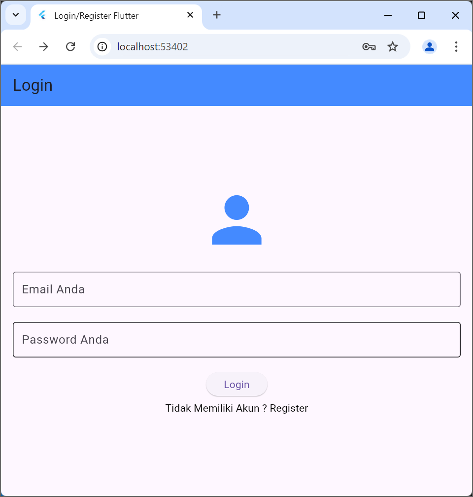
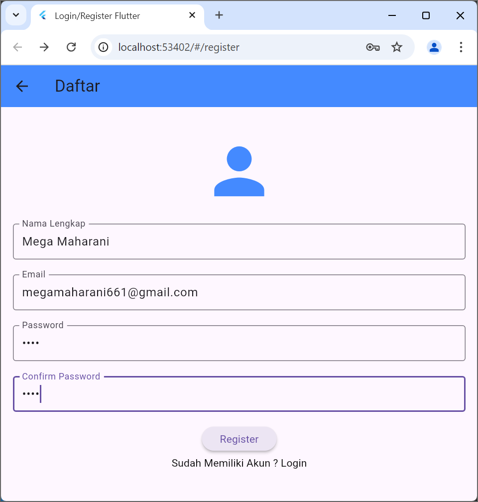
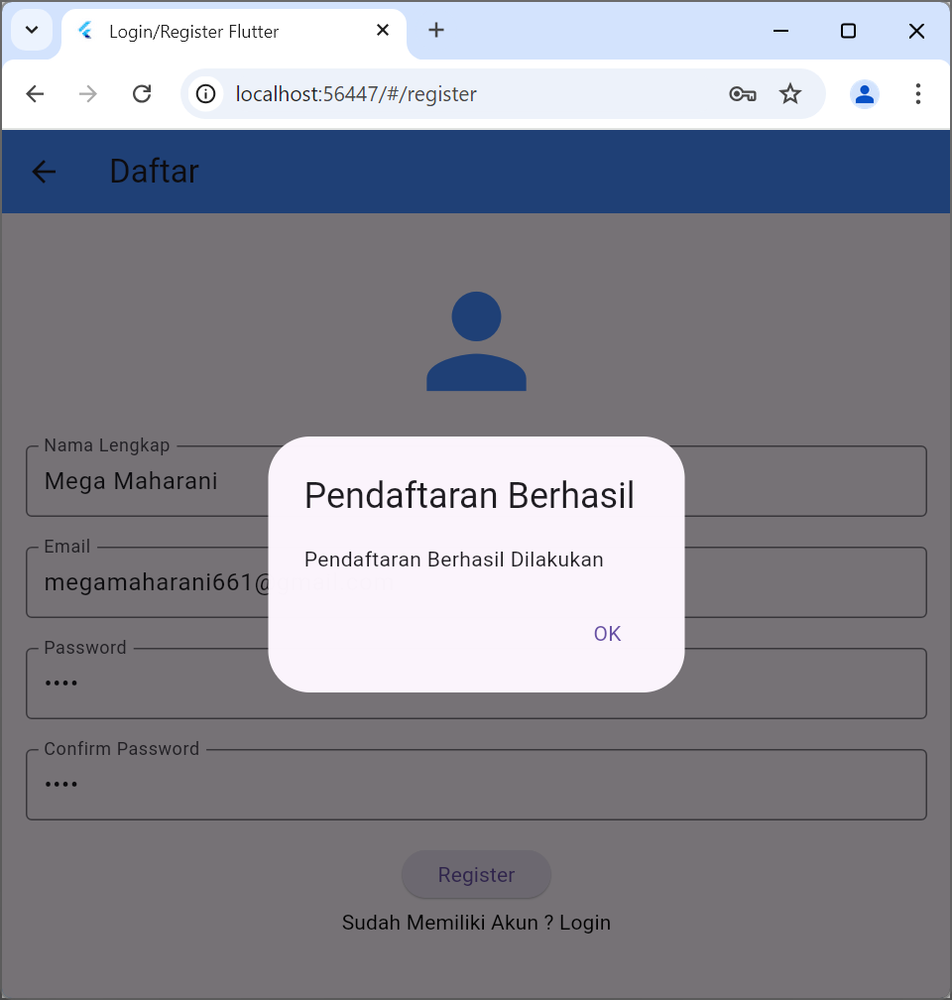
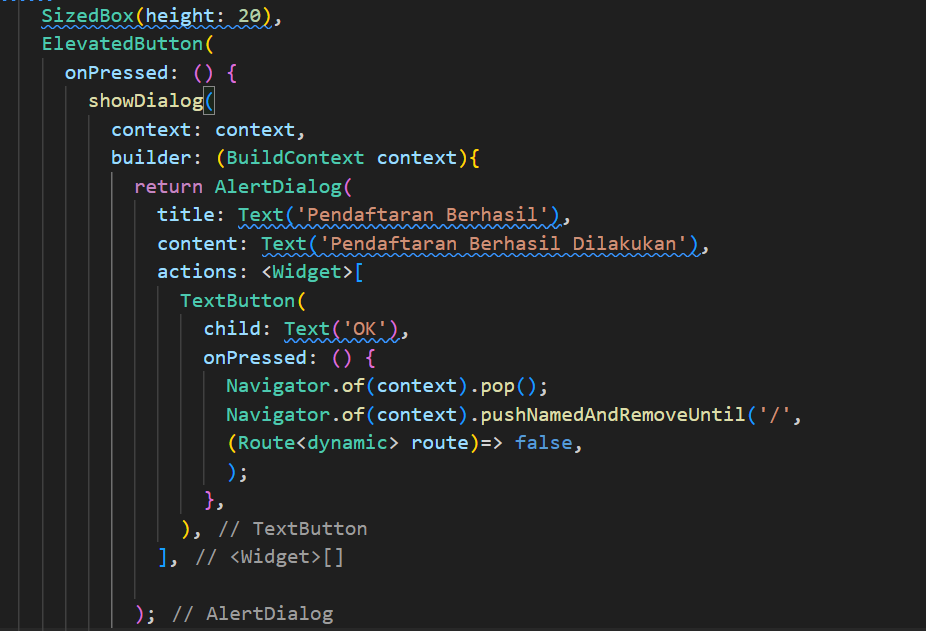
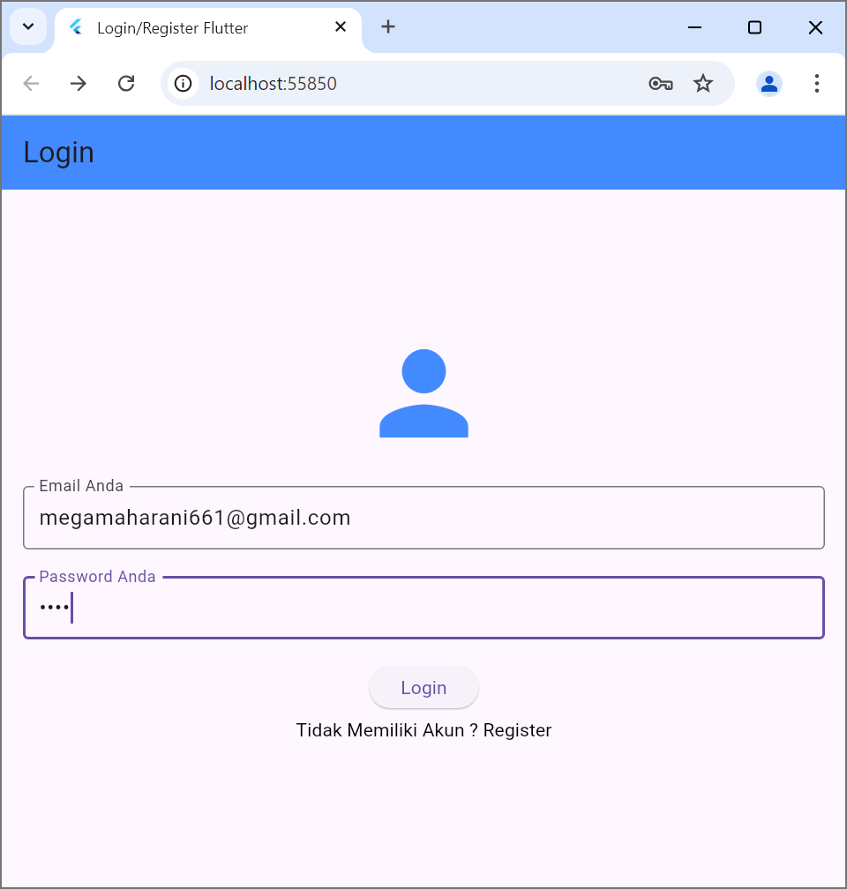
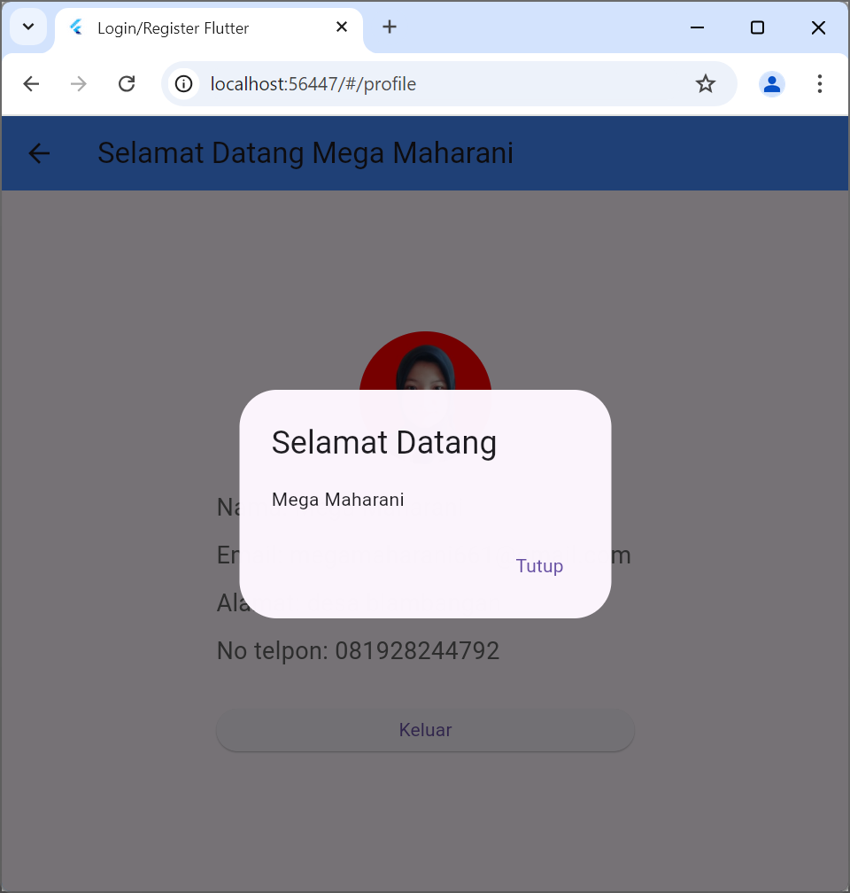
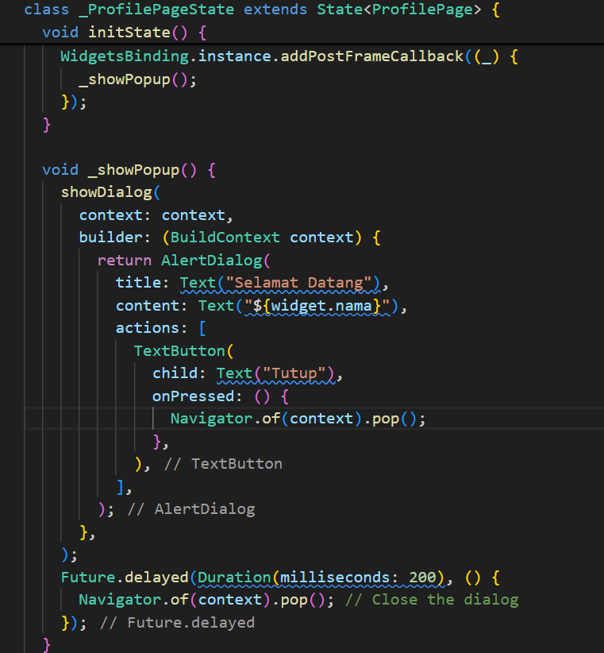
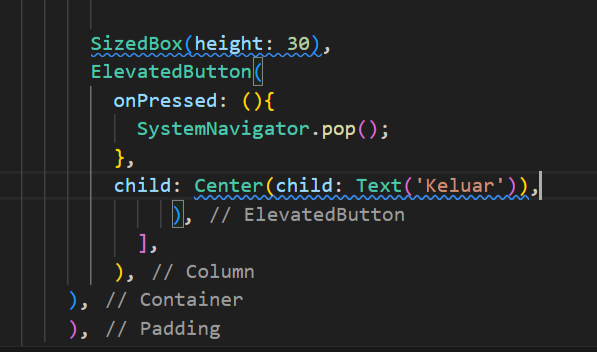

# register
A new Flutter project.

Tampilan awal login_page.dart:

Terdapat email dan password untuk login, jika tidak memiliki akun bisa register terlebih dahulu.

Tampilan register_page.dart:

Dalam register page ini bisa input nama lengkap, email, password, confirm password dan tombol register.

Jika tombol register diklik nanti akan muncul pop up selama 200ms dengan tulisan "pendaftaran berhasil dilakukan"

 
berikut ini adalah code untuk pop up

Setelah register, nanti akan diarahkan ke login_page.dart, lalu isi email dan passowrd untuk login.

Nanti akan muncul pop up yang bertuliskan "selamat datang dan nama" selama 200ms 

berikut ini adalah code untuk pop upnya

ketika diklik tombol keluar maka akan destroy ke halaman utama

Dalam onPressed: (){ SystemNavigator.pop();}: berfungsi untuk menutup aplikasi atau menutup layar, yang dimana di dalam tombol tersebut terdapat teks keluar dan berada di tengah.